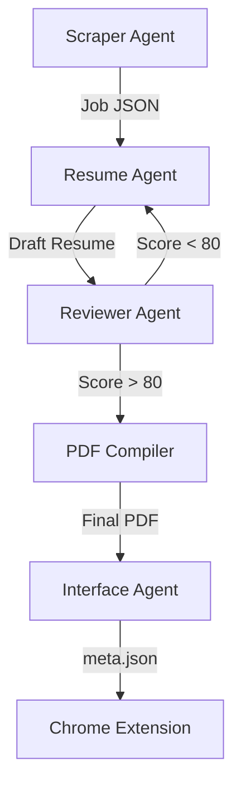

# PROJ-001: Job Automation System - Orchestration Plan

## PHASE 1: MULTI-AGENT ORCHESTRATION PLAN

### 🎯 Agent Breakdown
We will treat the codebase as a system of interacting agents.

1.  **🕵️ Scraper Agent (Hunter)**
    *   **Role:** Identifies jobs, extracts specific details (Applied Date, Posted Date, Original URL).
    *   **Key Files:** `jobright_scraper.py`, `run_pipeline.py`.
    *   **Responsibility:** Precision extraction, Bot detection evasion, JSON hydration.

2.  **✍️ Resume Agent (Writer)**
    *   **Role:** Crafts the tailored resume based on Job Description.
    *   **Key Files:** `resume_generator.py`, `pdf_compiler.py`.
    *   **Responsibility:** content injection, LaTeX compilation, PDF generation.

3.  **🧠 Reviewer Agent (Critic)**
    *   **Role:** Validates the fit between Resume and Job.
    *   **Key Files:** `resume_evaluator_prompt_v3.txt`.
    *   **Responsibility:** Quality assurance, scoring, "Go/No-Go" decision.

4.  **🔌 Interface Agent (Extension)**
    *   **Role:** Syncs data to the human user via Chrome.
    *   **Key Files:** `meta.json`, `folder_reader.py`.
    *   **Responsibility:** Ensuring the frontend sees the backend's work.

### 📐 Architecture & Flow


### 📂 File Structure Alignment
```text
job_automation/
├── scrapers/           # Scraper Agent Domain
├── core/               # Resume Agent Domain
├── scripts/            # Orchestration Scripts
└── output/             # Shared Memory (FileSystem)
```

### ⚡ Parallel Execution Paths
*   **Path A:** Scraper can run in batch mode (headless) independent of generation.
*   **Path B:** Resume generation can process `pending_jobs` folder in parallel.

---

## PHASE 2: CLAUDE EXECUTION GUIDANCE

### 💭 Deep Reasoning on Implementation
<thinking>
The current system has the components but lacks a unified "Health Check" or "Controller".
To enable true multi-agent behavior, we should verify the "Handoff Points":
1. Does Scraper produce clean `details.json`?
2. Does Resume Generator strictly read `details.json` and output `resume.json`?
3. Does the Extension Listener (`folder_reader.py`) pick them up?
</thinking>

### 🔨 Step-by-Step Coding Instructions
To verify and solidify this architecture, run these commands:

1.  **Audit the Handshake:**
    *   Check `jobright_scraper.py` output format against `resume_generator.py` input expectations.
2.  **Stress Test:**
    *   Run `run_pipeline.py --max_jobs 1` to generate a fresh artifact.
3.  **Verify Sync:**
    *   Check if `meta.json` was created correctly in the output folder.

### Step 4: Implement Extension Intelligence (User Request)
**Goal:** Enhance existing scripts for full auto-fill and "Context-Aware" Answering.

1.  **Enhance `question-solver.js`:**
    *   Verify `fetchAnswer()` correctly calls `native_host` with Context Triad.
    *   Ensure `typeAnswer` uses **robust stealth delays** (50-150ms).
    *   Confirm "Review Modal" UX is polished.

2.  **Enhance `generic.js`:**
    *   Replace primitive `setNativeValue` with stealthy `humanType` function.
    *   Ensure it covers Address, Phone, and Zip codes from `profile.json`.

3.  **Ensure `resume-uploader.js`:**
    *   Verify valid connection to Local Folder path found by `fold
    er_reader.py`.

### Step 5: Stealth & Anti-Detection (User Request)
**Goal:** Prevent bots from detecting "fast filling" behavior.

1.  **Stealth Typing Engine:**
    *   Standardize `humanType(element, text)` across ALL scripts.
    *   Implement variable speed typing (simulating thought pauses).
    *   Add `humanScroll` smoothness.

2.  **Platform Awareness:**
    *   Audit `workday.js` (if exists) or create logic to handle multi-page persistence.

### 🧪 Testing & Verification Strategy
- **Unit:** Test `_escape_latex` separately.
- **Integration:** Run full pipeline and check Chrome Extension.

### 🐛 Debugging Approach
*   If PDF fails: Check LaTeX logs in `output/`.
*   If Scraper fails: Run with `--visible` to see the bot check.
