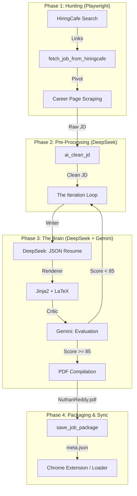

# Job Application Automation Pipeline: End-to-End Walkthrough

This document explains the end-to-end process, setup requirements, and execution steps for the job automation system as implemented in `job_auto_apply_internet.py`.

## 🛠️ Prerequisites & Setup

To run this pipeline, you need the following software and configuration:

### 1. System Requirements
- **Python 3.10+**
- **Homebrew** (for macOS dependencies)

### 2. Software Dependencies
Run the following commands to install the necessary tools:
```bash
# Install Python libraries
pip install -r requirements.txt

# Install Playwright (for web scraping)
playwright install chromium

# Install Tectonic (for LaTeX to PDF compilation)
brew install tectonic

# Install Poppler (Optional - for PDF to text extraction)
brew install poppler
```

### 3. Required Configuration Files
The script expects the following files in the project root:
- `.env`: Contains `DEEPSEEK_API_KEY` and `GEMINI_API_KEY`.
- `profile.json`: Your personal information (Name, Email, LinkedIn, etc.).
- `base_resume.tex`: Your primary LaTeX resume structure.
- `resume_template.tex`: The Jinja2-compatible LaTeX template for AI tailoring.

---

## 📐 The Pipeline Architecture

The system follows a **Multi-Agent Orchestration** pattern where specialized components (Hunter, Writer, Critic, and Interface) work together to automate the job search and application process.



## 🔍 Detailed Component Breakdown

### 1. 🕵️ The Hunter (Scraping)
- **Tool:** Playwright (Chromium)
- **Process:** It starts at a HiringCafe search URL, collects individual job links, and then performs a "pivot" navigation to the actual career site (Lever, Greenhouse, Workday, etc.). This ensures it gets the *actual* Job Description instead of the HiringCafe summary.

### 2. 🧹 The Cleaner (Preprocessing)
- **Tool:** DeepSeek
- **Process:** `ai_clean_jd` strips away marketing fluff and navigation noise while **preserving 100% of ATS-critical keywords**. This optimizes the JD for the AI writer in the next step.

### 3. ✍️ The Writer (Tailoring)
- **Tool:** DeepSeek (`generate_resume_json_deepseek`)
- **Action:** Takes your `base_resume.tex` (as context) and the cleaned JD to generate a highly tailored `resume.json`.

### 4. 🧠 The Critic (Evaluation & Feedback)
- **Tool:** Gemini (`evaluate_resume_with_gemini`)
- **Action:** It acts as a recruiter, scoring the generated resume (0-100) against the JD. If the score is low, it provides specific feedback (e.g., "Add more focus on Python testing") and triggers another iteration.

### 5. 🛠️ The Compiler (PDF Generation)
- **Tool:** Tectonic (LaTeX)
- **Action:** Once a resume is approved (Score > 85), it renders the final LaTeX and compiles it into a professional PDF (`NuthanReddy.pdf`).

### 6. 📂 The Interface (Packaging)
- **Action:** Creates a structured folder in `application_packages/` containing:
    - `NuthanReddy.pdf`: The final tailored resume.
    - `meta.json`: Core metadata for the Chrome Extension.
    - `JD.txt` & `apply_url.txt`: Reference data for auto-submitting.

## 🧠 The Prompt System

The pipeline's intelligence is distributed across several specialized prompts:

| Name | Role | Tool | Goal |
| :--- | :--- | :--- | :--- |
| **JD Cleaner** | Preprocessor | DeepSeek | Strips fluff, preserves 100% of ATS keywords. |
| **Relevance Filter**| Gatekeeper | DeepSeek | Ensures domain fit and checks for visa blockers. |
| **Resume Writer** | Creator | DeepSeek | Tailors resume to Albertsons context with irregular metrics. |
| **Resume Critic** | Evaluator | Gemini | Scores resume (0-100) across 10 credibility dimensions. |
| **Surgical Editor** | Refiner | DeepSeek | Fixes specific Gemini-identified issues without full regeneration. |

### Key Prompt Files:
- `prompts/clean_jd.txt`: Logic for keyword preservation.
- `resume_json_prompt_v3.txt`: The master tailoring instructions.
- `resume_evaluator_prompt_v3.txt`: The "Skeptical Recruiter" scoring logic.
- `resume_iteration_prompt_v3.txt`: Logic for precision revision based on feedback.

---

## 🚀 How to Execute
1. **Find & Tailor:** Run `python job_auto_apply_internet.py --start_url "..."` to generate packages.
2. **Apply:** Run `python job_auto_submit.py` or open the Chrome Extension to auto-fill the application forms from the generated packages.
